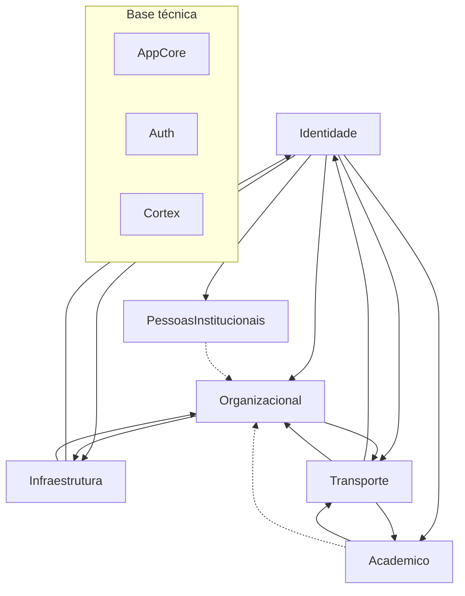

# Bounded Contexts / Domínios do Cortex

## 1. Objetivo

Este documento é o **mapa canônico** dos bounded contexts do Cortex **como implementados hoje**: módulos agregadores, apps Django (`PROJECT_APPS`), entidades principais, responsabilidades, regras já codificadas ou documentadas em `docs/domains/`, dependências entre contextos, prefixos HTTP e exceções à regra “um app, um model ORM principal”.

Use-o antes de explorar o código em volume (agentes, revisões, novas features).

Convenção: **domínio** com inicial maiúscula (pasta PascalCase); **app** em minúsculo (`Identidade/usuarios/`).

---

## 2. Princípios

1. Organização por **domínios de negócio**, não por camadas técnicas genéricas.
2. Cada módulo contém **apps internos finos**; em regra, um model principal por app.
3. Camadas por app: `models`, `business`, `rules`, `helpers`, `serializers`, `views`, `urls`.
4. **Views leves** — queries e regras em `business` / `rules` / `helpers`.
5. Novos produtos (ex.: capacidades de permissão) entram como apps no módulo de domínio, conforme ADR-001 e ADR-002.

---

## 3. Visão dos seis domínios e da base técnica

### Domínios de negócio (bounded contexts)

| # | Módulo | Prefixo HTTP (`Cortex/urls.py`) |
|---|--------|-----------------------------------|
| 1 | `Identidade` | `/cortex/identidade/` |
| 2 | `Organizacional` | `/cortex/organizacional/` |
| 3 | `PessoasInstitucionais` | `/cortex/pessoas-institucionais/` |
| 4 | `Academico` | `/cortex/academico/` |
| 5 | `Infraestrutura` | `/cortex/infraestrutura/` |
| 6 | `Transporte` | `/cortex/transporte/` |

### Base técnica (não são bounded contexts de negócio)

| Componente | Papel |
|------------|--------|
| `AppCore/` | Mixins, models base, `EmailOrCpfBackend`, storage, paginação, exceções |
| `Auth/` | API de autenticação — `/cortex/auth/` |
| `Cortex/` | `settings`, `PROJECT_APPS`, `urls` raiz, Celery Beat |

`AUTH_USER_MODEL = 'usuarios.Usuario'` (app `Identidade.usuarios`).

---

## 4. Cortes transversais

### Permissões Cortex L1–L3 (ADR-002)

Compiladas em `user.permissoes['cortex']` via `UsuarioPermissions.permissoes_cortex()`:

| Nível | Papel resumido |
|-------|----------------|
| L3 `EDITAR_TUDO` | staff / admin / superuser |
| L2 `LER_TUDO` | servidor ou terceirizado ativo |
| L1 `EDITAR_EU` | demais (ex.: aluno) |

Mixins AppCore (`IsAuthenticatedMixin`, `IsOwnerOrAdminMixin`, `IsAdminMixin`) e `escopar_queryset_cortex` aplicam escopo nas views.

### Permissões por módulo (além de L1–L3)

- **Infraestrutura:** `operar`, `cadastrar`, `autorizar`, `retirada_irrestrita` — por `Funcao` e/ou `Usuario` (`Infraestrutura.permissoes`); **sem rotas HTTP** no agregador (admin + compilação em `permissoes['infraestrutura']`).
- **Transporte:** capacidades documentadas em ADR-002 e `Transporte.permissoes` — em especial `conferir` e `visualizar_relatorio_alunos` (por função e usuário); app **sem** `urls` no agregador `Transporte/urls.py`.

### Matrícula distribuída (sem app `matriculas`)

Matrícula institucional **não** é entidade em Identidade. Campos `matricula` em:

- `PessoasInstitucionais.servidores.Servidor`
- `PessoasInstitucionais.terceirizados.Terceirizado`
- `Academico.aluno_cursos.AlunoCurso`

Unicidade e validação cruzada via regras de `Usuario` / perfis. Login por matrícula usa `Usuario.helper.buscar_por_matricula_valida` no `EmailOrCpfBackend`.

### `usuario_coletivo`

Conta compartilhada (`Usuario.usuario_coletivo`) com pools M2M (empresas, cargos, funções, setores) para escolher responsável em operações como empréstimo.

### Importações em lote

| Contexto | App | Model |
|----------|-----|--------|
| Usuários | `Identidade.usuarios` | `ImportacaoLote` |
| Infraestrutura | `Infraestrutura.importacoes` | `ImportacaoLote` |

São modelos distintos em apps distintos.

### Celery Beat (Transporte)

`gerar_execucoes_rotas_automaticas_task` — agendada a cada 5 minutos em `Cortex/settings.py` (`CELERY_BEAT_SCHEDULE`).

---

## 5. Domínios em detalhe

### 5.1 Identidade

| Item | Valor |
|------|--------|
| Módulo | `Identidade/` |
| Prefixo | `/cortex/identidade/` |
| Apps (`PROJECT_APPS`) | `usuarios`, `contatos`, `enderecos` |

**Entidades**

- `Usuario` — identidade e autenticação (`email`, `cpf` unique nullable; `usuario_coletivo`; pools coletivos).
- `Contato`, `Endereco`.
- `ImportacaoLote` — carga assíncrona de usuários (no app `usuarios`, não em app separado).

**Responsabilidade**

Cadastro base da pessoa, contato, endereço e pipeline de importação de usuários. Fornece `AUTH_USER_MODEL`.

**Regras / comportamentos relevantes (código)**

- Backend `EmailOrCpfBackend`: e-mail, CPF ou matrícula ativa; elegibilidade exige CPF ou matrícula válida.
- Permissões Cortex L1–L3 em `UsuarioPermissions`.
- **Não** existe app `matriculas` em `PROJECT_APPS`.

**Dependências**

Nenhum domínio de negócio upstream.

**Apps sem HTTP no agregador**

Nenhum — os três apps incluem rotas via `Identidade/urls.py`.

---

### 5.2 Organizacional

| Item | Valor |
|------|--------|
| Módulo | `Organizacional/` |
| Prefixo | `/cortex/organizacional/` |
| Apps | `setores`, `funcoes`, `vinculos` |

**Entidades**

- `Setor`
- `Funcao` — `papel_funcao`, `categoria`, `descricao`, `e_gratificada`, `exige_aluno`, `ativo`
- `SetorVinculo` — `usuario`, `setor`, `funcao`, `responsavel`

**Responsabilidade**

Estrutura de setores, catálogo de funções e vínculos usuário–setor–função, inclusive responsável de setor e monitoria como `Funcao`.

**Regras já presentes no modelo / domínio**

- Monitoria = registro em `Funcao`, não booleano em vínculo.
- `SetorVinculo` tratado como entidade de negócio; responsável via `responsavel=True`.
- Múltiplos vínculos por usuário; função esperada em todo vínculo (validação em business/rules).

**Dependências**

- `Identidade` (`Usuario`)

---

### 5.3 PessoasInstitucionais

| Item | Valor |
|------|--------|
| Módulo | `PessoasInstitucionais/` |
| Prefixo | `/cortex/pessoas-institucionais/` |
| Apps | `cargos`, `empresas_instituicoes`, `servidores`, `terceirizados` |

**Entidades**

- `Cargo` — catálogo
- `EmpresaInstituicao`
- `Servidor` — `cargo` obrigatório (`PROTECT`), `matricula`, `categoria`, `ativo`
- `Terceirizado` — `empresa_instituicao`, `cargo` opcional (`SET_NULL`), `matricula`, datas de vínculo

**Responsabilidade**

Perfis institucionais que especializam `Usuario`. **Implementado** — não há `Estagiario` no código.

**Regras**

- `Cargo` obrigatório para servidor; mesmo catálogo pode ser referenciado opcionalmente por terceirizado.
- `EmpresaInstituicao` para terceirizados.
- Matrículas de servidor/terceirizado participam do login e da unicidade global de matrícula.

**Dependências**

- `Identidade`
- Uso de `Cargo` / vínculos organizacionais indireto via `Usuario` e Organizacional

---

### 5.4 Academico

| Item | Valor |
|------|--------|
| Módulo | `Academico/` |
| Prefixo | `/cortex/academico/` |
| Apps | `cursos`, `alunos`, `aluno_cursos` |

**Entidades**

- `Curso`
- `Aluno` — perfil acadêmico; `faltas`, `is_bloqueado`, `quantidade_bloqueios` (transporte)
- `AlunoCurso` — vínculo aluno–curso com `matricula`

**Responsabilidade**

Formação e matrícula por curso. Monitoria organizacional fica em Organizacional (`Funcao` + `SetorVinculo`).

**Regras**

- Aluno monitor: vínculo de setor quando função exige aluno.
- Campos de bloqueio/faltas sincronizados pelo domínio Transporte.

**Dependências**

- `Identidade`
- Conceitual com `Organizacional` (monitoria)
- `Transporte` (tickets, strikes, bloqueios leem/atualizam `Aluno`)

---

### 5.5 Infraestrutura

| Item | Valor |
|------|--------|
| Módulo | `Infraestrutura/` |
| Prefixo | `/cortex/infraestrutura/` |
| Apps | `blocos`, `salas`, `recursos`, `permissoes`, `autorizacoes`, `emprestimos`, `importacoes` |

**Entidades principais**

- `Bloco`
- `Sala`, `SalaSetor` (associação sala–setor no app `salas`)
- `Recurso`
- `PermissaoFuncaoInfraestrutura`, `PermissaoUsuarioInfraestrutura` — flags `operar`, `cadastrar`, `autorizar`, `retirada_irrestrita`
- `Autorizacao`
- `Emprestimo`, `ItemEmprestimo`
- `ImportacaoLote` (importação de dados de infraestrutura)

**Responsabilidade**

Espaços físicos, recursos, autorizações e empréstimos (fluxo v1 que substitui operação legada Chameco/Sigec para este escopo). Detalhe operacional: `docs/domains/infraestrutura.md`; contexto de produto: `docs/schema/infraestrutura.md`.

**Regras / escopo v1**

- Permissões de módulo independentes dos níveis L1–L3 Cortex (ADR-002).
- **Reservas de sala fora da v1** (não modeladas como produto atual).
- `usuario_coletivo` impacta escolha de responsável em empréstimo.

**Dependências**

- `Identidade` (`Usuario`, pools coletivos)
- `Organizacional` (`Setor` via `SalaSetor`; funções para permissões)
- `PessoasInstitucionais` — regras de retirada usam perfis `Servidor` e `Terceirizado` ativos
- `Academico` — perfil `Aluno` nas regras de retirada (autorização explícita ou `retirada_irrestrita`)

**Rotas no agregador** (`Infraestrutura/urls.py`)

`blocos`, `salas`, `recursos`, `autorizacoes`, `emprestimos`, `importacoes`.

**Apps sem HTTP no agregador**

- `permissoes` — apenas admin + compilação em `user.permissoes['infraestrutura']`

**Exceções 1-app-1-model**

- `salas`: `Sala` + `SalaSetor`
- `emprestimos`: `Emprestimo` + `ItemEmprestimo`
- `permissoes`: dois models de permissão (função e usuário)

---

### 5.6 Transporte

| Item | Valor |
|------|--------|
| Módulo | `Transporte/` |
| Prefixo | `/cortex/transporte/` |
| Apps (12 em `PROJECT_APPS`) | ver tabela abaixo |

| App | Model / papel principal | HTTP no agregador |
|-----|-------------------------|-------------------|
| `percursos` | `Percurso` | sim |
| `rotas` | `Rota` | sim |
| `motoristas` | `Motorista` (perfil ligado a `Usuario`) | **não** |
| `calendario_operacional` | `DiaCalendarioTransporte` | **não** |
| `execucoes_rotas` | `ExecucaoRota` | sim |
| `tickets` | `Ticket` | sim |
| `strikes` | `Strike` | sim |
| `justificativas` | `Justificativa` | sim |
| `relatorios` | `RelatorioAlunos` — **objeto de domínio sem tabela ORM**; endpoints HTTP de relatório | sim |
| `permissoes` | `PermissaoFuncaoTransporte`, `PermissaoUsuarioTransporte` — `conferir`, `visualizar_relatorio_alunos` | **não** |
| `entradas_sem_ticket` | `EntradaSemTicket` | sim |
| `bloqueios` | operações sobre `Aluno` bloqueado — **app sem `models.py`** | sim |

**Responsabilidade**

Cadastro de percursos/rotas, calendário operacional, geração de execuções (incl. task Beat), reservas e filas (`Ticket`), faltas (`Strike`), justificativas, entradas sem ticket, bloqueios de alunos, relatórios agregados. Detalhe operacional: `docs/domains/transporte.md` (não duplicar aqui).

**Dependências**

- `Identidade` — motoristas, usuários conferentes, permissões
- `Academico` — `Aluno` / titular de ticket; campos de bloqueio em `Aluno`
- `Organizacional` — funções para `PermissaoFuncaoTransporte`
- `calendario_operacional` — dias que alimentam geração automática de execuções

**Exceções 1-app-1-model**

- `permissoes`: dois models
- `relatorios`: sem model Django persistido
- `bloqueios`: lógica HTTP/business sem ORM próprio

---

## 6. Relações entre os seis domínios

**Resumo textual**

- **Identidade** é upstream de todos os domínios de negócio.
- **Organizacional** estrutura setores/funções usados por Infraestrutura (salas, permissões) e Transporte (permissões por função).
- **PessoasInstitucionais** e **Academico** especializam `Usuario`; matrículas alimentam login.
- **Infraestrutura** consome usuários, setores e permissões compiladas; não depende de Acadêmico para o núcleo v1.
- **Transporte** consome alunos, usuários, calendário e funções; atualiza estado de bloqueio/faltas em `Aluno`.

---

## 7. Decisões consolidadas

| Tópico | Decisão |
|--------|---------|
| Nomenclatura | Domínio PascalCase; app minúsculo |
| Vínculo setor | Entidade `SetorVinculo` (não `SetorLotacao`) |
| Monitoria | `Funcao`, não booleano no vínculo |
| `Funcao` | Inclui `e_gratificada`, `exige_aluno`, `ativo` |
| `Cargo` | Catálogo com uso **obrigatório** em `Servidor` e **opcional** em `Terceirizado` |
| Matrícula | Distribuída em perfis; sem app `matriculas` |
| Modularização | ADR-001 — módulos na raiz, não pasta genérica `APPs/` |
| Permissões | ADR-002 — L1–L3 + módulos Infraestrutura/Transporte |
| Estagiário | Não implementado |

---

## 8. Ordem de implementação (histórico concluído)

1. **Base** — `AppCore`, `Auth`, `Cortex`, autenticação (`EmailOrCpfBackend`)
2. **Identidade** — usuários, contatos, endereços
3. **Organizacional** — setores, funções, vínculos
4. **PessoasInstitucionais** — cargos, empresas, servidores, terceirizados
5. **Academico** — cursos, alunos, aluno_cursos
6. **M5** — integração entre os quatro primeiros domínios
7. **Importação de usuários** — `ImportacaoLote` em `Identidade.usuarios`
8. **Infraestrutura** — blocos, salas, recursos, permissões, autorizações, empréstimos, importações
9. **Transporte** — 12 apps, Beat, bloqueios, relatórios, entradas sem ticket

Referência de marcos: `docs/planning/milestone-*-plan.md`.

---

## 9. Estrutura interna esperada por app

Cada app interno tende a conter:

- `__init__.py`, `apps.py`
- `models.py`, `business.py`, `rules.py`, `helpers.py`
- `serializers.py`, `views.py`, `urls.py` (quando expõe HTTP)

Opcionais: `choices.py`, `state.py`, `access.py`, `permissions.py`, `tasks.py`, `admin.py`.

---

## 10. Artefatos relacionados

| Artefato | Uso |
|----------|-----|
| `diagrams/03-core-erd.md` | DER textual |
| `diagrams/04-aggregates-and-invariants.md` | Agregados e invariantes |
| `decisions/ADR-001-modularizacao-por-dominio.md` | Modularização |
| `decisions/ADR-002-permissoes-cortex-niveis.md` | L1–L3 e extensões |
| `project/django-project-tree.md` | Árvore de pastas e apps |
| `domains/identidade.md` | Regras Identidade |
| `domains/organizacional.md` | Regras Organizacional |
| `domains/pessoas-institucionais.md` | Regras PessoasInstitucionais |
| `domains/academico.md` | Regras Acadêmico |
| `domains/transporte.md` | Regras Transporte (detalhe operacional) |
| `domains/infraestrutura.md` | Regras Infraestrutura (detalhe operacional) |
| `schema/infraestrutura.md` | Contexto de produto e modelagem Infraestrutura |

---

## 11. Resumo executivo

O Cortex implementa **seis bounded contexts** em módulos PascalCase, listados em `Cortex/settings.py` (`PROJECT_APPS`), roteados sob `/cortex/<dominio>/`, com `Usuario` em `Identidade.usuarios` e autenticação em `/cortex/auth/`.

- **Identidade:** `usuarios`, `contatos`, `enderecos` — importação de usuários em `usuarios`; **sem** `matriculas`.
- **Organizacional:** `setores`, `funcoes`, `vinculos`.
- **PessoasInstitucionais:** `cargos`, `empresas_instituicoes`, `servidores`, `terceirizados`.
- **Academico:** `cursos`, `alunos`, `aluno_cursos`.
- **Infraestrutura:** `blocos`, `salas`, `recursos`, `permissoes`, `autorizacoes`, `emprestimos`, `importacoes` — permissões sem HTTP agregado; reservas fora da v1.
- **Transporte:** doze apps — incluindo `motoristas`, `calendario_operacional` e `permissoes` sem rotas no agregador; `relatorios` com HTTP mas sem ORM persistido; `bloqueios` com HTTP sem `models.py`; task Beat a cada 5 min.

`AppCore`, `Auth` e `Cortex` sustentam os domínios sem serem contextos de negócio. Manter este mapa alinhado a `PROJECT_APPS`, `Cortex/urls.py` e `docs/domains/` após cada mudança estrutural.
