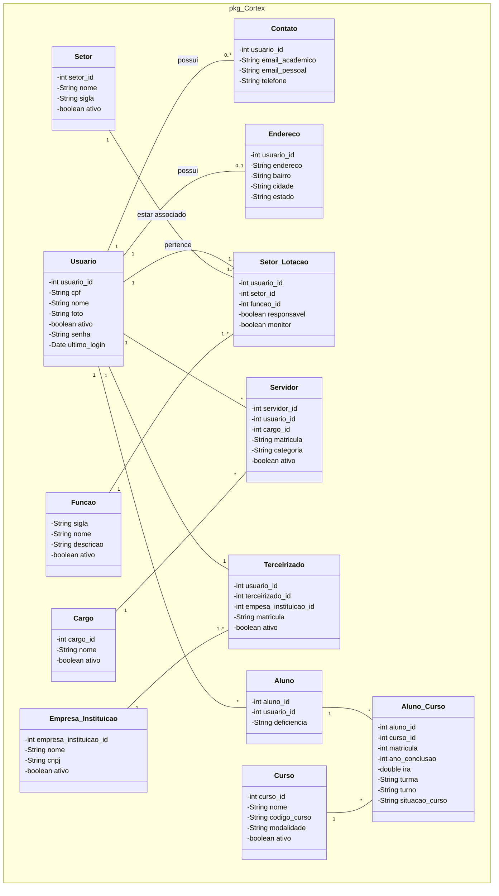

# Diagrama de Entidade-Relacionamento (DER) / Diagrama de Classes - Package Cortex (`pkg Cortex`)

Este documento contém a transcrição completa e detalhada do diagrama conceitual/lógico do sistema **Cortex**, incluindo todas as entidades, seus atributos (com tipos de dados) e os relacionamentos (com cardinalidades e direções).

---

## 1. Visão Geral das Entidades e Atributos

### 1.1. `Usuario`
* **Atributos:**
  * `- usuario_id : int`
  * `- cpf : String`
  * `- nome : String`
  * `- foto : String`
  * `- ativo : boolean`
  * `- senha : String`
  * `- ultimo_login : Date`

---

### 1.2. `Contato`
* **Atributos:**
  * `- usuario_id : int`
  * `- email_academico : String`
  * `- email_pessoal : String`
  * `- telefone : String`

---

### 1.3. `Endereco`
* **Atributos:**
  * `- usuario_id : int`
  * `- endereco : String`
  * `- bairro : String`
  * `- cidade : String`
  * `- estado : String`

---

### 1.4. `Setor`
* **Atributos:**
  * `- setor_id : int`
  * `- nome : String`
  * `- sigla : String`
  * `- ativo : boolean`

---

### 1.5. `Funcao`
* **Atributos:**
  * `- sigla : String`
  * `- nome : String`
  * `- descricao : String`
  * `- ativo : boolean`

---

### 1.6. `Setor_Lotacao`
* **Atributos:**
  * `- usuario_id : int`
  * `- setor_id : int`
  * `- funcao_id : int`
  * `- responsavel : boolean`
  * `- monitor : boolean`

---

### 1.7. `Servidor`
* **Atributos:**
  * `- servidor_id : int`
  * `- usuario_id : int`
  * `- cargo_id : int`
  * `- matricula : String`
  * `- categoria : String`
  * `- ativo : boolean`

---

### 1.8. `Cargo`
* **Atributos:**
  * `- cargo_id : int`
  * `- nome : String`
  * `- ativo : boolean`

---

### 1.9. `Terceirizado`
* **Atributos:**
  * `- usuario_id : int`
  * `- terceirizado_id : int`
  * `- empesa_instituicao_id : int`
  * `- matricula : String`
  * `- ativo : boolean`

---

### 1.10. `Empresa_Instituicao`
* **Atributos:**
  * `- empresa_instituicao_id : int`
  * `- nome : String`
  * `- cnpj : String`
  * `- ativo : boolean`

---

### 1.11. `Aluno`
* **Atributos:**
  * `- aluno_id : int`
  * `- usuario_id : int`
  * `- deficiencia : String`

---

### 1.12. `Aluno_Curso`
* **Atributos:**
  * `- aluno_id : int`
  * `- curso_id : int`
  * `- matricula : int`
  * `- ano_conclusao : int`
  * `- ira : double`
  * `- turma : String`
  * `- turno : String`
  * `- situacao_curso : String`

---

### 1.13. `Curso`
* **Atributos:**
  * `- curso_id : int`
  * `- nome : String`
  * `- codigo_curso : String`
  * `- modalidade : String`
  * `- ativo : boolean`

---

## 2. Relacionamentos e Cardinalidades

| Entidade Origem | Cardinalidade Origem | Verbo / Relação | Entidade Destino | Cardinalidade Destino | Notas |
| :--- | :---: | :---: | :--- | :---: | :--- |
| **Usuario** | `1` | `possui` | **Contato** | `0..*` | Um usuário pode ter 0 ou mais contatos. |
| **Usuario** | `1` | `possui` | **Endereco** | `0..1` | Um usuário pode ter 0 ou 1 endereço. |
| **Usuario** | `1` | `pertence` | **Setor_Lotacao** | `1..*` | Um usuário pertence a 1 ou mais lotações de setor. |
| **Setor** | `1` | `estar associado` | **Setor_Lotacao** | `1..*` | Um setor está associado a 1 ou mais lotações. |
| **Funcao** | `1` | *(associação)* | **Setor_Lotacao** | `1..*` | Uma função está associada a 1 ou mais lotações de setor. |
| **Usuario** | `1` | *(especialização / vínculo)* | **Servidor** | `*` | Um usuário pode ter vínculo(s) como Servidor. |
| **Cargo** | `1` | *(associação)* | **Servidor** | `*` | Um cargo está associado a 0 ou vários servidores. |
| **Usuario** | `1` | *(especialização / vínculo)* | **Terceirizado** | `1` | Um usuário pode ser associado como Terceirizado. |
| **Empresa_Instituicao** | `1` | *(associação)* | **Terceirizado** | `1..*` | Uma empresa/instituição vincula 1 ou mais terceirizados. |
| **Usuario** | `1` | *(especialização / vínculo)* | **Aluno** | `*` | Um usuário pode ter perfil(ais) de Aluno. |
| **Aluno** | `1` | *(associação)* | **Aluno_Curso** | `*` | Um aluno pode estar matriculado em 1 ou mais cursos (`Aluno_Curso`). |
| **Curso** | `1` | *(associação)* | **Aluno_Curso** | `*` | Um curso possui 0 ou vários alunos matriculados (`Aluno_Curso`). |

---

## 3. Representação em Diagrama Mermaid (Markdown Native)

