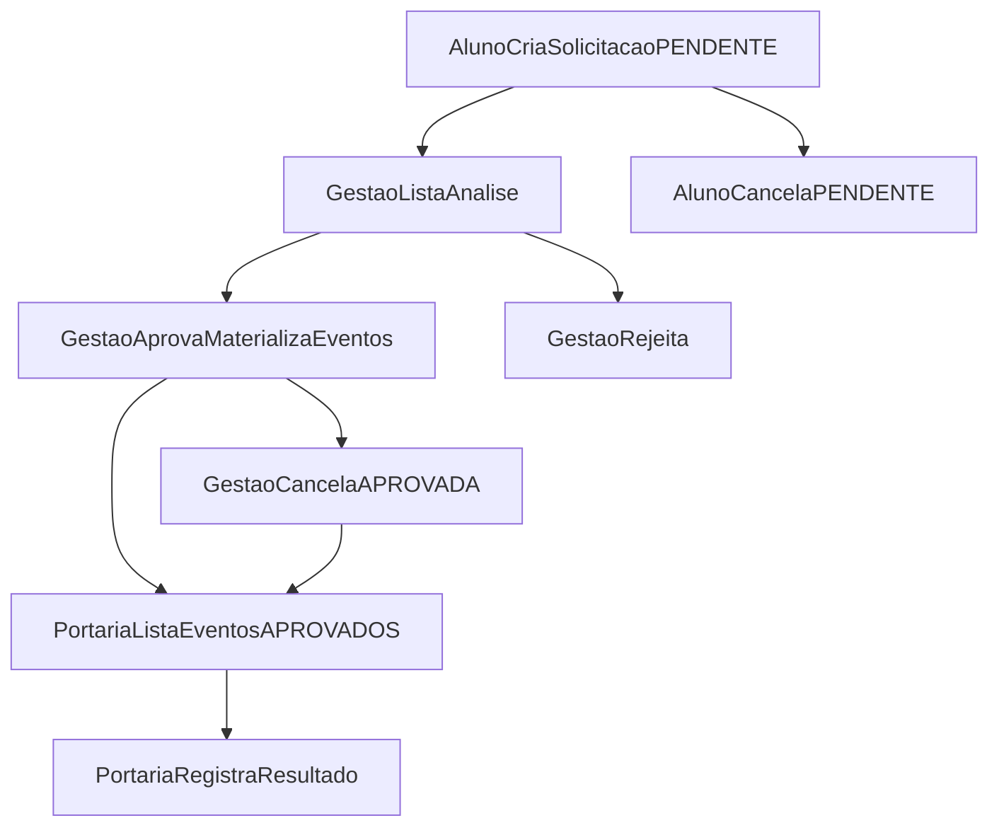

# Diretrizes do Domínio: AcessoCampus

> **Status:** PLANEJADO — módulo **AcessoCampus** ainda **não** implementado; **não** registrar em `PROJECT_APPS` até concluir as etapas do [milestone](../planning/milestone-acesso-campus.md).

Este arquivo é a **especificação funcional canônica** do bounded context **AcessoCampus** (circulação e autorizações de alunos de Ensino Médio na portaria).

## Visão geral

O domínio **AcessoCampus** digitaliza o fluxo institucional em que o aluno de **Ensino Médio** solicita exceções de horário (entrada tardia, saída antecipada, ausências, períodos, recorrências, saída com retorno); a **gestão** analisa e aprova ou rejeita em **decisão única**; após aprovação, a **portaria** enxerga **eventos** do dia e registra o que ocorreu. A solicitação **aprovada** **é** a autorização — não existe entidade `Autorizacao` separada.

### Identificadores canônicos

| Item | Valor |
|------|--------|
| Módulo (pasta) | `AcessoCampus/` |
| Prefixo HTTP | `/cortex/acesso-campus/` |
| `app_name` agregador | `acesso_campus` |
| Chave em `user.permissoes` | `acesso_campus` |

### Personas

| Persona | Capacidades típicas | Observação |
|---------|---------------------|------------|
| Aluno EM elegível | `solicitar` | Só próprias solicitações; L1 Cortex |
| Gestão (coordenador/diretor apto) | `analisar_solicitacoes`, em geral `visualizar_historico` | Não opera portaria sem `operar_portaria` |
| Vigilante / guarita | `operar_portaria` | Não analisa sem `analisar_solicitacoes` |
| L3 (`EDITAR_TUDO`) | Todas | Bypass operacional documentado na API |

### Estrutura de apps (planejada)

```text
AcessoCampus/
├── __init__.py
├── urls.py                    # app_name = 'acesso_campus'
├── solicitacoes/              # SolicitacaoAcesso
├── programacoes/                # ProgramacaoAcesso
├── eventos/                     # EventoAcesso
├── registros/                   # RegistroAcesso
└── permissoes/                  # PermissaoFuncaoAcessoCampus, PermissaoUsuarioAcessoCampus (sem urls HTTP)
```

Camadas por app: `models`, `choices`, `rules`, `helpers`, `business`, `serializers`, `views`, `urls`. **`state.py` não é necessário.**

---

## Escopo

### Entra

- Solicitação, programação, materialização de eventos na aprovação, fila operacional da portaria, registro 0..1 por evento, histórico consultável, permissões OR função/usuário, confirmação derivada, snapshots na criação, auditoria `simple-history` + `*_por`/`*_em`.
- Elegibilidade: aluno ativo, `Usuario` ativo, `SituacaoAluno.MATRICULADO`, `AlunoCurso.ativo` em `Curso` com `nivel_ensino=ENSINO_MEDIO` (`NivelEnsino.ENSINO_MEDIO=1`).
- Multi-curso: campo obrigatório `aluno_curso` na solicitação; deve pertencer ao `aluno`.
- Timezone: `America/Fortaleza`.

### Não entra (v1 documentada)

- Entidade **Campus**; multi-campi na mesma instância.
- **Responsável legal** no fluxo (exclusão explícita; ver LGPD em [implantacao](../project/implantacao-acesso-campus.md)).
- Reuso de **Infraestrutura.autorizacoes**, **Sigec**, **Transporte** (`EntradaSemTicket` é ônibus).
- Correção de registro pela API (v1: replay idempotente; mudança de resultado gravado → 400; correção só L3/admin se policy futura).
- Frontend MeuIF (outro repositório).
- Inferir EM pelo **nome** do curso.

### Dependências consumidas

`Aluno`, `AlunoCurso`, `Curso`, `Usuario`, `Funcao`, `SetorVinculo` — **sem duplicar**.

---

## Jornadas

### Fluxo principal (mermaid)



### Aluno (`solicitar`)

1. POST `solicitacoes/` com `aluno_curso`, `justificativa`, `exige_confirmacao` (sugestão), e 1..N `programacoes`.
2. Sistema valida elegibilidade EM, snapshots preenchidos, sem sobreposição.
3. GET lista/detalhe só do próprio aluno.
4. POST `cancelar/` apenas se `status=PENDENTE`.

### Gestão (`analisar_solicitacoes`)

1. GET `analise/solicitacoes/` (default `status=PENDENTE`).
2. Aprovar: POST `aprovar/` com `{ exige_confirmacao, observacao_analise? }` — transação atômica + materialização de `EventoAcesso` + congelamento de `exige_confirmacao` por evento.
3. Rejeitar: POST `rejeitar/` — só `PENDENTE`.
4. Cancelar aprovada: POST `analise/.../cancelar/` — marca `CANCELADA`; eventos futuros **sem** `RegistroAcesso` recebem `cancelado_em`; eventos já registrados permanecem.

### Portaria (`operar_portaria`)

1. GET `portaria/eventos/?data=` (default hoje, Fortaleza).
2. Só eventos de solicitação `APROVADA`, `cancelado_em` nulo, no recorte operacional.
3. **Não** exibir solicitações `PENDENTE` na fila.
4. POST `registrar/` com `resultado`, `observacao?`; `registrado_por` = vigilante físico (pool em conta coletiva, padrão Infraestrutura).

### Histórico (`visualizar_historico` ou `analisar_solicitacoes` ou L3)

GET `historico/` e `historico/{pk}/` com programações, eventos, objeto `confirmacao` e registros.

---

## Estados e choices

### StatusSolicitacaoAcesso (persistido)

| Constante | Valor |
|-----------|-------|
| `PENDENTE` | 1 |
| `APROVADA` | 2 |
| `REJEITADA` | 3 |
| `CANCELADA` | 4 |

Transições permitidas:

| De | Para | Quem |
|----|------|------|
| `PENDENTE` | `APROVADA` | Gestão (`aprovar`) |
| `PENDENTE` | `REJEITADA` | Gestão (`rejeitar`) |
| `PENDENTE` | `CANCELADA` | Aluno (`cancelar`) |
| `APROVADA` | `CANCELADA` | Gestão (`analise/.../cancelar`) |

### TipoProgramacaoAcesso

| Constante | Valor |
|-----------|-------|
| `ENTRADA_TARDIA` | 1 |
| `SAIDA_ANTECIPADA` | 2 |
| `AUSENCIA_INTEGRAL` | 3 |
| `PERIODO` | 4 |
| `RECORRENTE` | 5 |
| `SAIDA_COM_RETORNO` | 6 |

`ProgramacaoAcesso` editável **somente** enquanto solicitação `PENDENTE`. Após `APROVADA`, eventos congelados.

### TipoEventoAcesso

| Constante | Valor |
|-----------|-------|
| `ENTRADA` | 1 |
| `SAIDA` | 2 |
| `RETORNO` | 3 |
| `AUSENCIA` | 4 |

### ResultadoRegistroAcesso

| Constante | Valor |
|-----------|-------|
| `REALIZADO` | 1 |
| `DIVERGENCIA` | 2 |
| `NAO_COMPARECEU` | 3 |
| `IMPEDIDO` | 4 |

### SituacaoConfirmacao (derivada, **não** persistida)

| Valor | Regra |
|-------|--------|
| `RECEBIDA` | Existe `RegistroAcesso` (independente de `exige_confirmacao`) |
| `PENDENTE` | Sem registro e `exige_confirmacao=true` |
| `NAO_EXIGIDA` | Sem registro e `exige_confirmacao=false` |

---

## Materialização de eventos (na aprovação)

| TipoProgramacaoAcesso | Eventos gerados |
|----------------------|-----------------|
| `ENTRADA_TARDIA` | 1 × `ENTRADA` na data/hora prevista |
| `SAIDA_ANTECIPADA` | 1 × `SAIDA` |
| `AUSENCIA_INTEGRAL` | 1 × `AUSENCIA` no dia (data; hora opcional — 00:00 local se não informada) |
| `PERIODO` | 1 × `AUSENCIA` por **dia civil** inclusive entre `data_inicio` e `data_fim` |
| `RECORRENTE` | 1 evento por data que case `dias_semana` entre `data_inicio` e `data_fim` inclusive; `dias_semana`: inteiros 0=segunda … 6=domingo; **sempre** `data_fim` |
| `SAIDA_COM_RETORNO` | 2 eventos no mesmo dia: `SAIDA` e `RETORNO`, ligados por `evento_relacionado` (`OneToOne` simétrico); cada um pode ter seu `RegistroAcesso` |

Uma solicitação tem **1..N** `ProgramacaoAcesso`.

---

## Regras e invariantes

### Elegibilidade (`solicitar`)

- Aluno ativo, usuário ativo, `SituacaoAluno.MATRICULADO`.
- `AlunoCurso.ativo` no curso referenciado com `Curso.nivel_ensino=ENSINO_MEDIO`.
- Aluno de curso superior/técnico/pós **não** solicita (400 regra de negócio).

### Sobreposição

Sem sobreposição de janela data/hora com outra solicitação `PENDENTE` ou `APROVADA` do **mesmo aluno** (considerando eventos não cancelados). `SAIDA_COM_RETORNO` ocupa intervalo saída–retorno.

### Confirmação e `exige_confirmacao`

- Boolean em `SolicitacaoAcesso`; aluno **sugere** na criação; gestão **define/confirma** na aprovação.
- Copiado e **congelado** em cada `EventoAcesso` na materialização.
- **Nunca** reescrever eventos aprovados silenciosamente.

### Payload `confirmacao` (sempre em detalhe evento/solicitação)

```json
{
  "confirmacao": {
    "situacao_confirmacao": "PENDENTE",
    "situacao_confirmacao_display": "Pendente",
    "exige_confirmacao": true,
    "registro": null
  }
}
```

Se houver registro:

```json
"registro": {
  "id": 1,
  "resultado": 1,
  "resultado_display": "Realizado",
  "registrado_em": "2026-10-08T14:30:00-03:00",
  "registrado_por": { "id": 42, "nome": "Nome Vigilante" },
  "observacao": ""
}
```

### Registro na portaria

- `RegistroAcesso` **0..1** por `EventoAcesso` (`OneToOne`).
- Só eventos elegíveis na fila (APROVADA, não cancelado, data operacional).
- Replay do **mesmo** `resultado` → 200 idempotente; **alterar** resultado já gravado → 400.
- `registrado_por`: `Usuario` pessoa física; **nunca** `usuario_coletivo`.

### Concorrência

Aprovação: `select_for_update` em `SolicitacaoAcesso`.

### Transporte

**Não** misturar bloqueio de transporte com este módulo.

---

## Permissões do módulo

Compilação planejada: `permissoes_acesso_campus()` — OR entre `PermissaoFuncaoAcessoCampus` (por `Funcao` dos vínculos ativos) e `PermissaoUsuarioAcessoCampus` (OneToOne `Usuario`). **L3** recebe todas as capacidades.

| Capacidade | Descrição |
|------------|-----------|
| `solicitar` | CRUD escopo próprio de solicitações (criar/listar/detalhe/cancelar pendente) |
| `analisar_solicitacoes` | Fila e ações de análise |
| `operar_portaria` | Fila de eventos e registrar |
| `visualizar_historico` | Listagem/detalhe histórico ampliado |

Mixins planejados em `AcessoCampus/permissoes/access.py`: `PodeAnalisarAcessoCampusMixin`, `PodeOperarPortariaAcessoCampusMixin`, `PodeVisualizarHistoricoAcessoCampusMixin`.

Documentação viva: `documentacao_acesso_campus()` espelhando regras (ADR-002).

### Matriz de autorização (endpoint × capacidade)

| Endpoint (name) | `solicitar` | `analisar_solicitacoes` | `operar_portaria` | `visualizar_historico` | L3 |
|-----------------|-------------|-------------------------|-------------------|------------------------|-----|
| `solicitacao-list` GET/POST | próprio | — | — | — | sim |
| `solicitacao-detail` GET | próprio | — | — | — | sim |
| `solicitacao-cancelar` POST | próprio PENDENTE | — | — | — | sim |
| `analise-solicitacao-list` GET | — | sim | — | — | sim |
| `analise-solicitacao-detail` GET | — | sim | — | — | sim |
| `analise-solicitacao-aprovar` POST | — | sim | — | — | sim |
| `analise-solicitacao-rejeitar` POST | — | sim | — | — | sim |
| `analise-solicitacao-cancelar` POST | — | sim | — | — | sim |
| `portaria-evento-list` GET | — | — | sim | — | sim |
| `portaria-evento-detail` GET | — | — | sim | — | sim |
| `portaria-evento-registrar` POST | — | — | sim | — | sim |
| `historico-list` GET | — | sim | — | sim | sim |
| `historico-detail` GET | — | sim | — | sim | sim |

Histórico: quem tem `analisar_solicitacoes` **ou** `visualizar_historico` **ou** L3.

Filtros de listagem **nunca** expandem escopo além da capacidade.

---

## Filtros de interface (query params)

| Listagem | Filtros |
|----------|---------|
| Aluno `solicitacoes/` | `status`, `paginacao` |
| Análise | `status` (default `PENDENTE`), busca nome/cpf/matrícula, `curso_id`, `data`, `paginacao` |
| Portaria | `data` (default hoje), busca, `tipo`, `situacao_confirmacao`, `paginacao` |
| Histórico | `status`, `aluno_id`, `curso_id`, `data_inicio`, `data_fim`, busca, `paginacao` |

---

## Endpoints (names obrigatórios)

Prefixo: `/cortex/acesso-campus/`. Namespace: `acesso_campus:`.

| Método | Path | name |
|--------|------|------|
| GET, POST | `solicitacoes/` | `solicitacao-list` |
| GET | `solicitacoes/{pk}/` | `solicitacao-detail` |
| POST | `solicitacoes/{pk}/cancelar/` | `solicitacao-cancelar` |
| GET | `analise/solicitacoes/` | `analise-solicitacao-list` |
| GET | `analise/solicitacoes/{pk}/` | `analise-solicitacao-detail` |
| POST | `analise/solicitacoes/{pk}/aprovar/` | `analise-solicitacao-aprovar` |
| POST | `analise/solicitacoes/{pk}/rejeitar/` | `analise-solicitacao-rejeitar` |
| POST | `analise/solicitacoes/{pk}/cancelar/` | `analise-solicitacao-cancelar` |
| GET | `portaria/eventos/` | `portaria-evento-list` |
| GET | `portaria/eventos/{pk}/` | `portaria-evento-detail` |
| POST | `portaria/eventos/{pk}/registrar/` | `portaria-evento-registrar` |
| GET | `historico/` | `historico-list` |
| GET | `historico/{pk}/` | `historico-detail` |

Contrato detalhado: [docs/api/acesso-campus.md](../api/acesso-campus.md).

---

## Auditoria e privacidade

- `BasicModel` + `simple-history` nos models de negócio.
- Campos: `analisada_por`, `analisada_em`, `observacao_analise`, `cancelada_por`, `cancelada_em`.
- Snapshots na criação: `aluno_nome`, `curso_nome`, `matricula` — **não** mutáveis na análise.
- **Responsável legal:** fora do MVP; validação institucional/LGPD antes de produção envolvendo menores.

---

## Critérios de aceite (produto v1)

1. Aluno EM elegível cria solicitação com programações; aluno superior recebe 400.
2. Gestão aprova/rejeita/cancela conforme matriz de estados; materialização correta para os seis tipos de programação.
3. Portaria lista só eventos aprovados do dia; registra quatro resultados; idempotência e bloqueio de alteração.
4. Objeto `confirmacao` consistente com regras derivadas.
5. Permissões OR função/usuário; L3 total; vigilante não analisa; gestão sem `operar_portaria` não registra.
6. Conta coletiva autentica; `registrado_por` sempre pessoa física.
7. Sobreposição e concorrência na aprovação cobertas por testes.
8. Swagger com `**Permissões:**` em cada view.

---

## O que NÃO fazer

- **Não** afirmar que o módulo já está em `PROJECT_APPS`.
- **Não** criar `Campus`, `Autorizacao` separada, ou duplicar `Aluno`/`Usuario` vigilante.
- **Não** inferir EM pelo nome do curso.
- **Não** acoplar a Transporte ou `Infraestrutura.autorizacoes`.
- **Não** usar `state.py` estilo Transporte para este domínio.
- **Não** reescrever eventos aprovados ao mudar `exige_confirmacao` retroativamente.
- **Não** incluir responsável legal no MVP sem ADR e parecer LGPD.
- **Não** usar ORM ou transações manuais nas views (delegar ao `business`).

---

## Artefatos relacionados

- [ADR-003](../decisions/ADR-003-acesso-campus.md)
- [Schema](../schema/acesso-campus.md)
- [API](../api/acesso-campus.md)
- [Milestone](../planning/milestone-acesso-campus.md)
- [Implantação](../project/implantacao-acesso-campus.md)
