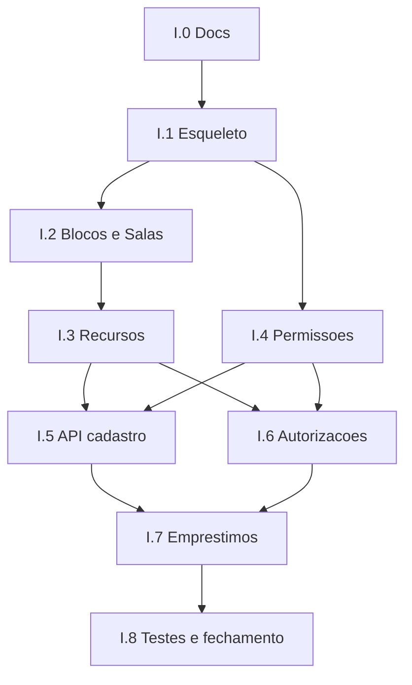

# Plano da Milestone — Domínio Infraestrutura (v1)

## Objetivo

Implementar o domínio `Infraestrutura` do Cortex/MeuIF, substituindo o Chameco legado no fluxo de **liberação de recursos** (foco em chaves) por operadores autorizados, com autorizações, empréstimos multi-item e permissões por função.

Fonte canônica de regras: [docs/schema/infraestrutura.md](../schema/infraestrutura.md).  
Padrões de código: [ADR-001](../decisions/ADR-001-modularizacao-por-dominio.md), [ADR-002](../decisions/ADR-002-permissoes-cortex-niveis.md), [skill de implementação](../antigravity/skill-implementation.md).

---

## Resultado esperado ao final da milestone

1. Módulo `Infraestrutura/` com apps finos registrados e roteados em `/cortex/infraestrutura/`.
2. Cadastro de blocos, salas, vínculos sala–setor e recursos (com desativação).
3. Autorizações por sala ou recurso (temp/permanente, com revogação).
4. Empréstimos multi-item: retirada, devolução parcial, troca de titular e consulta/filtros.
5. Capacidades por função (`PermissaoFuncaoInfraestrutura`) expostas em `permissoes_infraestrutura()`.
6. Matriz L1/L2/L3 aplicada: L1 só ativos próprios; L2 opera; L3 autoriza (e tipicamente cadastra).
7. Testes das regras centrais e documentação Swagger com bloco `**Permissões:**`.

---

## Escopo — o que entra (v1)

| ID | Entrega | Apps / artefatos | Status |
|----|---------|------------------|--------|
| E1 | Esqueleto do domínio | `Infraestrutura/`, `urls.py`, `INSTALLED_APPS`, `Cortex/urls.py` | Concluída |
| E2 | Espaço físico | `blocos`, `salas` (`Bloco`, `Sala`, `SalaSetor`) | Concluída |
| E3 | Recursos | `recursos` (`Recurso`, choices de tipo, estado derivado) | Concluída |
| E4 | Permissões do módulo | `permissoes` + hook em `UsuarioPermissions` | Concluída |
| E5 | Autorizações | `autorizacoes` | Pendente |
| E6 | Empréstimos | `emprestimos` (CRUD operacional + ações) | Pendente |
| E7 | Docs / ADR | Atualizar exemplo Sigec→Infraestrutura na ADR-002 e referências | Pendente |
| E8 | Testes | Regras de retirada, XOR autorização, troca, escopo L1 | Pendente |

## Escopo — o que **não** entra (v1)

- App `reservas` e qualquer regra de reserva.
- Multi-campi; e-mail/notificação do alerta >24h (só sinal no frontend).
- Distinção chave principal/reserva; patrimônio/tombo dedicado.
- Espelho local de usuários/tokens.
- Migração automática de dados do Chameco (pode ser milestone à parte).
- UI frontend MeuIF (contrato de API apenas).

---

## Decisões consolidadas (não reabrir sem ADR)

1. Domínio `Infraestrutura/` (não `Sigec/`).
2. Camadas por app: `models` → `rules` → `helpers` → `business` → `serializers` → `views` → `urls`.
3. Views AppCore; sem ORM na view; regras em português (`pode_*`, `validar_*`).
4. Capacidades: `operar`, `cadastrar`, `autorizar`, `retirada_irrestrita`.
5. Regras auto: `SalaSetor`→chave; cargo limpeza→qualquer chave; demais→autorização ou irrestrita.
6. Autorização XOR sala|recurso; sala cobre recursos futuros.
7. Empréstimo sem status explícito; troca sem vínculo entre registros.
8. L1 < L2 < L3 conforme ADR-002.

---

## Ordem rastreável de implementação

Cada etapa tem **pré-requisito**, **entregáveis**, **critério de saída** e **ID** para rastreio em PRs/commits (`infra-I.x`).

### Progresso

| Etapa | Status |
|-------|--------|
| I.0 | Concluída |
| I.1 | Concluída (13/07/2026) |
| I.2 | Concluída (13/07/2026) |
| I.3 | Concluída (13/07/2026) |
| I.4 | Concluída (13/07/2026) |
| I.5–I.8 | Pendente |

### Etapa I.0 — Alinhamento documental

| | |
|--|--|
| **Pré-requisito** | Schema consolidado |
| **Entregáveis** | `docs/schema/infraestrutura.md` atualizado; este plano; entradas em `docs/README.md` |
| **Critério de saída** | Time consegue implementar sem reabrir decisões de v1 |
| **Status** | Concluída nesta entrega documental |

---

### Etapa I.1 — Esqueleto do módulo

| | |
|--|--|
| **Pré-requisito** | I.0 |
| **Entregáveis** | Pasta `Infraestrutura/` com `__init__.py` e `urls.py` (`app_name = 'infraestrutura'`); include em `Cortex/urls.py` como `path('cortex/infraestrutura/', ...)`; placeholder vazio até os apps existirem |
| **Critério de saída** | Rota do domínio existe e não quebra o boot do Django |
| **Padrões** | Espelhar `Organizacional/urls.py`; `name=` em todo `path` futuro |
| **Status** | Concluída (13/07/2026) — `Infraestrutura/__init__.py`, `Infraestrutura/urls.py` (`app_name = 'infraestrutura'`), include em `Cortex/urls.py`; `python manage.py check` OK |

---

### Etapa I.2 — Models: `blocos` e `salas`

| | |
|--|--|
| **Pré-requisito** | I.1 |
| **Entregáveis** | Apps `Organizacional`-style: `Infraestrutura.blocos`, `Infraestrutura.salas`; models `Bloco`, `Sala`, `SalaSetor`; `ativo`; `unique_together` sala+setor; migrations; registro em `PROJECT_APPS` |
| **Critério de saída** | Migrações aplicam; FKs com `PROTECT` onde histórico importa |
| **Camadas mínimas** | Models + admin opcional; business/rules podem ser mínimos (CRUD + desativar) |
| **Status** | Concluída (13/07/2026) — apps `Infraestrutura.blocos` e `Infraestrutura.salas`; models `Bloco`, `Sala`, `SalaSetor`; camadas rules/helpers/business/admin; migrations `0001_initial`; registro em `PROJECT_APPS` |

**Campos mínimos sugeridos**

- `Bloco`: `nome`, `ativo` (+ BasicModel)
- `Sala`: `bloco` FK, `nome`, `ativo`
- `SalaSetor`: `sala`, `setor` (Organizacional.setores), unicidade (sala, setor)

---

### Etapa I.3 — Model: `recursos`

| | |
|--|--|
| **Pré-requisito** | I.2 |
| **Entregáveis** | App `recursos`; `Recurso` com `codigo` único, `tipo` (choices), `sala` (obrigatória se chave), `descricao`, `em_avaria` (estado simples), `ativo`; helper/property de **estado derivado**; rules de validação por tipo |
| **Critério de saída** | Não cria chave sem sala; desativar em vez de delete de negócio |
| **Ordem de arquivos** | `choices.py` → `models.py` → `rules.py` → `helpers.py` → `business.py` |
| **Status** | Concluída (13/07/2026) — app `Infraestrutura.recursos`; model `Recurso`; `TipoRecurso`/`EstadoRecurso`; property `estado_derivado`; rules `validar_sala_por_tipo` e `codigo_unico`; migration `0001_initial`; registro em `PROJECT_APPS` |

Estado derivado (prioridade): `avaria` → `emprestado` → `reservado` (sempre falso na v1) → `disponivel`.

---

### Etapa I.4 — Permissões do módulo

| | |
|--|--|
| **Pré-requisito** | I.1 (pode paralelizar com I.2–I.3 após Funcao existir) |
| **Entregáveis** | App `permissoes`; model `PermissaoFuncaoInfraestrutura` OneToOne/`FK` única com `Funcao`; flags booleanas das quatro capacidades; método `permissoes_infraestrutura()` em `UsuarioPermissions`; `documentacao_infraestrutura()` no mesmo PR; atualizar ADR-002 (exemplo Sigec → Infraestrutura) |
| **Critério de saída** | `GET` de permissões do usuário inclui chave `infraestrutura` com flags compiladas a partir dos vínculos ativos |
| **Padrões** | ADR-002 extensibilidade; descoberta automática `permissoes_*()` |
| **Status** | Concluída (13/07/2026) — app `Infraestrutura.permissoes`; model `PermissaoFuncaoInfraestrutura`; `permissoes_infraestrutura()` e `documentacao_infraestrutura()`; ADR-002 atualizada; testes de compilação |

**Compilação sugerida:** união das flags das funções dos `SetorVinculo` ativos do usuário (OR das capacidades).

---

### Etapa I.5 — API de cadastro (blocos, salas, recursos)

| | |
|--|--|
| **Pré-requisito** | I.2, I.3, I.4 |
| **Entregáveis** | Serializers, views AppCore, urls (`*-list`, `*-detail`, ações desativar/reativar); Swagger com `**Permissões:**`; gate capacidade `cadastrar` (e/ou L3 conforme matriz) |
| **Critério de saída** | CRUD autenticado coerente; L1 sem `cadastrar` recebe 403 |
| **Testes** | Criar/editar/desativar; validação chave sem sala |

---

### Etapa I.6 — Autorizações

| | |
|--|--|
| **Pré-requisito** | I.3, I.4 |
| **Entregáveis** | App `autorizacoes`; model com beneficiário, concedente, sala XOR recurso, datas, revogação, observação; rules `validar_alvo_xor`, `pode_conceder`, vigência; endpoints conceder/listar/revogar |
| **Critério de saída** | Impossível salvar sala e recurso juntos; só `autorizar` concede/revoga; autorização por sala vale para recurso novo da sala na checagem de retirada |
| **Testes** | XOR; revogação; vigência temporária |

---

### Etapa I.7 — Empréstimos (núcleo operacional)

| | |
|--|--|
| **Pré-requisito** | I.5, I.6 |
| **Entregáveis** | App `emprestimos`; `Emprestimo` (solicitante, responsável, `retirada_em`, observação); `ItemEmprestimo` (recurso, `devolvido_em`); business transacional: |
| | — `realizar_emprestimo` |
| | — `devolver_itens` (parcial) |
| | — `trocar_titular` (devolver + novo, mesmas rules, sem FK entre empréstimos) |
| | Helpers de elegibilidade do solicitante (SalaSetor, cargo limpeza, Autorizacao, `retirada_irrestrita`); impedir segundo aberto no mesmo recurso; listagens/filtros |
| **Critério de saída** | Fluxo guarda→usuário completo via API; parcial encerra só quando todos devolvidos |
| **Padrões** | `transaction.atomic` só na view base; rules sem `.save()`; nomes em português |

**Escopo de leitura**

- Com `operar` (L2 típico): consulta ampla + filtros.
- L1 sem `operar`: apenas empréstimos **ativos** em que é solicitante.
- Alerta >24h: campo/anotação calculada na serialização (`atrasado` / similar) para o frontend — sem job de e-mail.

---

### Etapa I.8 — Testes de integração e fechamento

| | |
|--|--|
| **Pré-requisito** | I.7 |
| **Entregáveis** | Suite cobrindo matriz de retirada, troca de titular, devolução parcial, escopo L1, permissões; checklist da skill de implementação; seed mínimo opcional (bloco/sala/chave + permissão em função de teste) |
| **Critério de saída** | Critérios de aceite abaixo todos verdes |

---

## Diagrama da ordem

---

## Critérios de aceite da milestone

A milestone só fecha quando:

1. **Módulo físico** `Infraestrutura/` com apps v1 (sem `reservas`) em `INSTALLED_APPS` e sob `/cortex/infraestrutura/`.
2. **Cadastro** de Bloco, Sala, SalaSetor e Recurso com desativação e regras por tipo.
3. **Permissões** `permissoes_infraestrutura()` + documentação espelhada.
4. **Autorizações** XOR, vigência, revogação e efeito em runtime na retirada.
5. **Empréstimos** multi-item, parcial, troca atômica sem vínculo, sem empréstimo duplo aberto.
6. **Escopo L1/L2/L3** conforme schema; Swagger com `**Permissões:**` em toda view.
7. **Testes** das regras centrais passando.
8. **Docs** schema + este plano + ADR-002 sem exemplo `Sigec/` obsoleto como caminho de módulo.

---

## Rastreio sugerido de commits (pt-BR Conventional Commits)

| Etapa | Exemplo de mensagem |
|-------|---------------------|
| I.1 | `chore: esqueleto do módulo Infraestrutura e roteamento base` |
| I.2 | `feat: models de blocos e salas do domínio Infraestrutura` |
| I.3 | `feat: cadastro de recursos físicos com estado derivado` |
| I.4 | `feat: permissões de Infraestrutura por função` |
| I.5 | `feat: API de cadastro estrutural de Infraestrutura` |
| I.6 | `feat: autorizações de retirada por sala ou recurso` |
| I.7 | `feat: empréstimos multi-item com retirada devolução e troca` |
| I.8 | `test: cobertura das regras centrais de Infraestrutura` |

---

## Dependências de outros domínios

| Dependência | Uso |
|-------------|-----|
| `Identidade.usuarios.Usuario` | Solicitante, responsável, beneficiário |
| `Identidade.matriculas.Matricula` | Busca/exibição |
| `Organizacional.setores.Setor` | `SalaSetor` |
| `Organizacional.funcoes.Funcao` | Capacidades |
| `Organizacional.vinculos.SetorVinculo` | Regra automática de chave + compilação de permissões |
| `PessoasInstitucionais.cargos.Cargo` (+ vínculo de terceirizado) | Regra servente de limpeza |

Se o cargo de limpeza ainda não existir no seed, incluir na I.7/I.8 (data migration ou seed) o cargo acordado, sem inventar regra alternativa.

---

## Referências rápidas de conformidade

- Ordem de implementação por arquivo: Models → Rules → Helpers → Business → Serializers → Views → URLs.
- `apps.py`: `name = 'Infraestrutura.<app>'`.
- Sub-apps **não** declaram `app_name`; só o agregador.
- Toda `path()` com `name=`; testes com `reverse('infraestrutura:...')`.
- Não misturar inglês em métodos de domínio.
