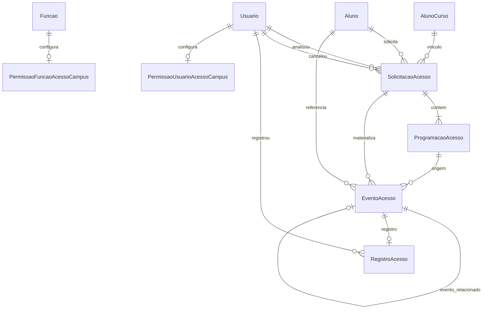

# AcessoCampus — modelagem de dados (planejada)

> **Status:** PLANEJADO — models **não** existem no código; este DER descreve a implementação futura do módulo **AcessoCampus/**.

Timezone de datas/horas operacionais: **America/Fortaleza**.

Pré-requisito Acadêmico: `Curso.nivel_ensino` (`NivelEnsino`: `ENSINO_MEDIO=1`, `TECNICO=2`, `SUPERIOR=3`, `POS_GRADUACAO=4`). Elegibilidade exige `ENSINO_MEDIO`.

---

## Visão ER

Cardinalidades operacionais:

- `SolicitacaoAcesso` 1 — N `ProgramacaoAcesso` (mínimo 1 na criação).
- `ProgramacaoAcesso` 1 — N `EventoAcesso` (após aprovação).
- `EventoAcesso` 1 — 0..1 `RegistroAcesso` (`OneToOne`).
- `EventoAcesso` 0..1 — 0..1 `EventoAcesso` (`evento_relacionado`, simétrico para `SAIDA_COM_RETORNO`).

---

## Persistido vs derivado

| Conceito | Persistido? | Onde |
|----------|-------------|------|
| `StatusSolicitacaoAcesso` | Sim | `SolicitacaoAcesso.status` |
| `TipoProgramacaoAcesso` | Sim | `ProgramacaoAcesso.tipo` |
| `TipoEventoAcesso` | Sim | `EventoAcesso.tipo` |
| `ResultadoRegistroAcesso` | Sim | `RegistroAcesso.resultado` |
| `exige_confirmacao` (solicitação) | Sim | `SolicitacaoAcesso.exige_confirmacao` |
| `exige_confirmacao` (operacional) | Sim (cópia congelada) | `EventoAcesso.exige_confirmacao` |
| `SituacaoConfirmacao` | **Não** | Calculada em serializer/helper |
| Objeto API `confirmacao` | **Não** (projeção) | Montado na resposta |

---

## SolicitacaoAcesso

App: `AcessoCampus/solicitacoes/`. Herda `BasicModel` (+ `history`).

| Campo | Tipo | on_delete / null | Descrição |
|-------|------|------------------|-----------|
| `id` | PK | — | |
| `aluno` | FK → `Academico.alunos.Aluno` | `PROTECT` | Dono acadêmico |
| `aluno_curso` | FK → `Academico.aluno_cursos.AlunoCurso` | `PROTECT` | Vínculo ativo usado; deve pertencer a `aluno` |
| `justificativa` | `TextField` | — | Texto livre |
| `status` | `IntegerField` | — | `StatusSolicitacaoAcesso` |
| `exige_confirmacao` | `BooleanField` | — | Sugestão aluno; confirmada na aprovação |
| `analisada_por` | FK → `Usuario` | `SET_NULL`, null | Quem aprovou/rejeitou |
| `analisada_em` | `DateTimeField` | null | |
| `observacao_analise` | `TextField` | blank | |
| `cancelada_por` | FK → `Usuario` | `SET_NULL`, null | Aluno (pendente) ou gestão (aprovada) |
| `cancelada_em` | `DateTimeField` | null | |
| `aluno_nome` | `CharField` | — | Snapshot na **criação** |
| `curso_nome` | `CharField` | — | Snapshot na **criação** |
| `matricula` | `CharField` | blank | Snapshot na **criação** |
| `created_at`, `updated_at` | — | BasicModel | |

### StatusSolicitacaoAcesso (choices)

| Constante | Int |
|-----------|-----|
| `PENDENTE` | 1 |
| `APROVADA` | 2 |
| `REJEITADA` | 3 |
| `CANCELADA` | 4 |

**Índices sugeridos:** `(aluno_id, status)`, `(status, created_at)`, `(aluno_curso_id)`.

---

## ProgramacaoAcesso

App: `AcessoCampus/programacoes/`.

| Campo | Tipo | on_delete | Descrição |
|-------|------|-----------|-----------|
| `solicitacao` | FK → `SolicitacaoAcesso` | `CASCADE` | |
| `tipo` | `IntegerField` | — | `TipoProgramacaoAcesso` |
| `data_inicio` | `DateField` | — | |
| `data_fim` | `DateField` | — | Obrigatória em `PERIODO` e `RECORRENTE`; igual `data_inicio` nos pontuais e `SAIDA_COM_RETORNO` |
| `hora_prevista` | `TimeField` | null | Obrigatória `ENTRADA_TARDIA`, `SAIDA_ANTECIPADA` |
| `hora_saida` | `TimeField` | null | Obrigatória `SAIDA_COM_RETORNO` |
| `hora_retorno` | `TimeField` | null | Obrigatória `SAIDA_COM_RETORNO`; **retorno > saída** |
| `dias_semana` | `JSONField` (lista int) | — | Obrigatória não vazia em `RECORRENTE`; 0=seg … 6=dom |
| `observacao` | `TextField` | blank | Opcional |

### TipoProgramacaoAcesso

| Constante | Int |
|-----------|-----|
| `ENTRADA_TARDIA` | 1 |
| `SAIDA_ANTECIPADA` | 2 |
| `AUSENCIA_INTEGRAL` | 3 |
| `PERIODO` | 4 |
| `RECORRENTE` | 5 |
| `SAIDA_COM_RETORNO` | 6 |

**Índices sugeridos:** `(solicitacao_id, tipo)`.

**Regra:** editável apenas com solicitação `PENDENTE` (enforced em `rules`/`business`, não DB).

---

## EventoAcesso

App: `AcessoCampus/eventos/`.

| Campo | Tipo | on_delete | Descrição |
|-------|------|-----------|-----------|
| `solicitacao` | FK → `SolicitacaoAcesso` | `PROTECT` | |
| `programacao` | FK → `ProgramacaoAcesso` | `PROTECT` | |
| `aluno` | FK → `Aluno` | `PROTECT` | Desnormalizado para consultas portaria |
| `tipo` | `IntegerField` | — | `TipoEventoAcesso` |
| `data_hora_prevista` | `DateTimeField` | — | Fortaleza-aware |
| `exige_confirmacao` | `BooleanField` | — | **Cópia congelada** na materialização |
| `evento_relacionado` | `OneToOneField` self | `SET_NULL`, null | Par saída/retorno |
| `cancelado_em` | `DateTimeField` | null | Preenchido se solicitação aprovada cancelada depois |

### TipoEventoAcesso

| Constante | Int |
|-----------|-----|
| `ENTRADA` | 1 |
| `SAIDA` | 2 |
| `RETORNO` | 3 |
| `AUSENCIA` | 4 |

**Índices sugeridos:** `(data_hora_prevista)`, `(aluno_id, data_hora_prevista)`, `(solicitacao_id)`, `(cancelado_em)` parcial null.

**Unique (sugerido):** `RegistroAcesso.evento` OneToOne já garante 0..1 registro.

---

## RegistroAcesso

App: `AcessoCampus/registros/`.

| Campo | Tipo | on_delete | Descrição |
|-------|------|-----------|-----------|
| `evento` | `OneToOneField` → `EventoAcesso` | `PROTECT` | |
| `registrado_por` | FK → `Usuario` | `PROTECT` | Pessoa física; **nunca** `usuario_coletivo` |
| `registrado_em` | `DateTimeField` | — | Auto ou business |
| `resultado` | `IntegerField` | — | `ResultadoRegistroAcesso` |
| `observacao` | `TextField` | blank | |

### ResultadoRegistroAcesso

| Constante | Int |
|-----------|-----|
| `REALIZADO` | 1 |
| `DIVERGENCIA` | 2 |
| `NAO_COMPARECEU` | 3 |
| `IMPEDIDO` | 4 |

**Índices sugeridos:** `(registrado_em)`, `(registrado_por_id)`.

---

## Permissões (sem rotas HTTP)

App: `AcessoCampus/permissoes/`.

### PermissaoFuncaoAcessoCampus

Relação **1:1** (ou FK única) com `Organizacional.funcoes.Funcao`.

| Campo | Tipo | Descrição |
|-------|------|-----------|
| `funcao` | FK / OneToOne | |
| `solicitar` | bool | |
| `analisar_solicitacoes` | bool | |
| `operar_portaria` | bool | |
| `visualizar_historico` | bool | |

### PermissaoUsuarioAcessoCampus

**OneToOne** com `Usuario` — mesmas quatro flags (OR com função).

Compilação: chave payload `acesso_campus` via `permissoes_acesso_campus()`. L3: todas true.

---

## Constraints e validações (aplicação)

| Regra | Camada |
|-------|--------|
| `aluno_curso.aluno_id == aluno_id` | `rules` |
| EM via `nivel_ensino`, não nome | `rules` |
| Campos obrigatórios por `tipo` programação | `rules` |
| `RECORRENTE` sempre com `data_fim` | `rules` |
| Sobreposição temporal entre solicitações | `rules` + query em `helpers` |
| Materialização atômica na aprovação | `business` (transação na camada de negócio; **não** na view) |
| `registrado_por` não coletivo | `rules` |
| Idempotência registro | `business` |

---

## Materialização (referência)

| Programacao.tipo | Eventos |
|------------------|---------|
| `ENTRADA_TARDIA` | 1 × `ENTRADA` |
| `SAIDA_ANTECIPADA` | 1 × `SAIDA` |
| `AUSENCIA_INTEGRAL` | 1 × `AUSENCIA` (dia) |
| `PERIODO` | N × `AUSENCIA` (dias civis inclusive) |
| `RECORRENTE` | N × conforme `dias_semana` ∩ [início, fim] |
| `SAIDA_COM_RETORNO` | 2 × (`SAIDA`, `RETORNO`) + `evento_relacionado` |

---

## O que não modelar

- Entidade **Campus**.
- **Autorizacao** separada (aprovação = autorização).
- **SituacaoConfirmacao** em coluna.
- Duplicata de **Aluno**, matrícula global, ou perfil vigilante.
- Vínculo com **Transporte** ou **Infraestrutura.autorizacoes**.

---

## Artefatos relacionados

- [Domínio](../domains/acesso-campus.md)
- [API](../api/acesso-campus.md)
- [ADR-003](../decisions/ADR-003-acesso-campus.md)
- [Implantação](../project/implantacao-acesso-campus.md)
