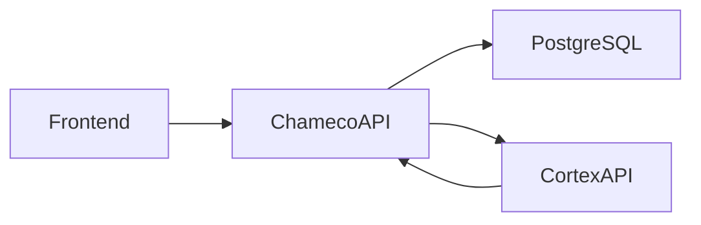

# ChamecoAPI — Visão geral do sistema

## O que é

O **ChamecoAPI** é uma API REST desenvolvida em **Django** e **Django REST Framework** para gerenciar o **empréstimo de chaves de salas** em uma instituição (campus do IFPI, integrado ao **Cortex**). Ele controla quem pode retirar e devolver chaves, registra o histórico de empréstimos e mantém o cadastro de blocos, salas, chaves e usuários autorizados.

Em resumo: é o backend de um sistema de **controle de chaves físicas**, com autenticação centralizada no Cortex e regras de permissão por tipo de usuário, setor e autorização por sala.

---

## Arquitetura e integração

| Componente     | Função                                                            |
| -------------- | ----------------------------------------------------------------- |
| **Frontend**   | Consome a API (não está neste repositório)                        |
| **ChamecoAPI** | Regras de negócio, empréstimos e cadastros                        |
| **PostgreSQL** | Persistência local (usuários, salas, chaves, empréstimos, tokens) |
| **CortexAPI**  | Autenticação (login/senha) e dados oficiais do usuário            |

A documentação interativa fica em `chameco/api/schema/swagger/`.

---

## Modelo de dados

A hierarquia espacial é:

**Bloco → Sala → Chave**

| Entidade                 | Descrição                                                                           |
| ------------------------ | ----------------------------------------------------------------------------------- |
| **Blocos**               | Prédios ou agrupamentos (Bloco A, B, C…)                                            |
| **Salas**                | Ambientes dentro de um bloco                                                        |
| **Chaves**               | Chaves vinculadas a uma sala; podem ser principal ou reserva; têm flag `disponivel` |
| **Usuarios**             | Espelho local do usuário do Cortex (`id_cortex`, nome, setor, tipo, e-mail)         |
| **PessoasAutorizadas**   | Relação N:N entre usuário e sala — quem pode usar aquela sala                       |
| **UsuariosResponsaveis** | Pessoas que “assumem” o empréstimo em nome de outro (ex.: vigilante, portaria)      |
| **Emprestimos**          | Registro de retirada/devolução com solicitante, responsável, chave e observação     |
| **Tokens**               | Cache local dos tokens JWT do Cortex (access, refresh e id do usuário)              |

---

## Como funciona a autenticação

O Chameco **não armazena senhas**. O fluxo é:

1. O cliente envia **CPF e senha** para `POST /chameco/api/v1/login/`.
2. A API repassa as credenciais ao Cortex (`cortex/api/token/`).
3. Se o login for válido, a API:
   - Gera um **hash SHA-256** a partir dos tokens access + refresh;
   - Guarda access (1 dia), refresh (7 dias) e `id_user` no banco;
   - Sincroniza ou cria o registro local em `Usuarios`;
   - Devolve o **hash** como `token` ao cliente (somente se o usuário tiver permissão de uso).
4. Nas demais requisições, o `token` (hash) vai em **query param** ou no body, conforme o endpoint.
5. Antes de cada operação autenticada, a API valida o access no Cortex ou renova via refresh.

Há também `POST /verify-token/` para checar se o hash ainda é válido.

---

## Níveis de permissão

### 1. Pode fazer login (`CanLogIn`)

Tipos como admin, TI, coordenador, aluno, professor, técnicos, profissionais de saúde, vigilante etc., ou setores como TI, Guarita, Direção, Limpeza, Aux. Cozinha.

### 2. Pode usar o sistema (`CanUseSystem`)

Para **realizar, finalizar ou trocar empréstimos**. Lista mais ampla em `bases.py`: tipos administrativos, professores, coordenadores, vigilantes, motoristas etc., e dezenas de setores (coordenações, biblioteca, saúde, guarita, limpeza…).

Quem **não** está nessas listas ainda pode logar, mas não opera empréstimos.

### 3. Administrador (`IsAdmin`)

Apenas tipos **admin** ou **ti**, ou setor **TI**. Pode criar, editar e excluir:

- Usuários (e autorizações por sala)
- Blocos, salas e chaves
- Usuários responsáveis

Leitura (GET) exige apenas token válido (`IsTokenValid`).

### 4. Autorização por sala (regra de empréstimo)

Na **retirada** ou **troca** de chave, se o solicitante **não** for de tipo/setor com acesso livre, precisa constar em `PessoasAutorizadas` para a sala da chave. Caso contrário: _"Usuário não autorizado para usar a sala."_

---

## Fluxo de empréstimo

### Realizar empréstimo (`POST /realizar-emprestimo/`)

1. Chave deve existir e estar **disponível**.
2. Solicitante e responsável devem existir.
3. Valida autorização do solicitante na sala (se aplicável).
4. Cria `Emprestimos` com horário atual.
5. Marca a chave como **indisponível**.

Campos: `chave`, `usuario_solicitante`, `usuario_responsavel`, `token`, `observacao` (opcional).

### Finalizar empréstimo (`POST /finalizar-emprestimo/`)

1. Localiza o empréstimo pelo `id_emprestimo`.
2. Não pode já estar finalizado.
3. Grava `horario_devolucao`.
4. Libera a chave (`disponivel = True`).

### Trocar empréstimo (`POST /trocar-emprestimo/`)

Quando a chave passa de uma pessoa para outra **sem devolver à portaria**:

1. Finaliza o empréstimo atual (devolução no momento da troca).
2. Abre novo empréstimo com novo solicitante e responsável.
3. A chave permanece indisponível.
4. Valida autorização do **novo** solicitante na sala.

---

## Endpoints principais

| Recurso      | Rotas                                                                 | Observação                                                            |
| ------------ | --------------------------------------------------------------------- | --------------------------------------------------------------------- |
| Login        | `login/`, `verify-token/`                                             | Público                                                               |
| Usuários     | `usuarios/`                                                           | Filtros: nome, tipo, setor, sala_autorizada                           |
| Blocos       | `blocos/`                                                             | Filtro por nome                                                       |
| Salas        | `salas/`                                                              | Filtros: nome, bloco                                                  |
| Chaves       | `chaves/`                                                             | Filtros: sala, bloco, disponivel                                      |
| Responsáveis | `responsaveis/`                                                       | Vinculados a um superusuário                                          |
| Empréstimos  | `emprestimos/`                                                        | Somente leitura; filtros: data, solicitante, responsavel, finalizados |
| Operações    | `realizar-emprestimo/`, `finalizar-emprestimo/`, `trocar-emprestimo/` | Exigem `CanUseSystem`                                                 |

Paginação padrão: **5 itens** por página; parâmetro `pagination` (máx. 100). Buscas por texto usam **unaccent** no PostgreSQL (busca sem acento).

---

## Regras de negócio resumidas

| Regra                      | Comportamento                                                                       |
| -------------------------- | ----------------------------------------------------------------------------------- |
| Uma chave emprestada       | `disponivel = false` até devolução ou troca que encerre o registro                  |
| Chave principal vs reserva | Campo `principal`; descrição opcional em `descricao`                                |
| Dados do usuário           | Nome, setor e tipo vêm do Cortex; localmente só se complementa autorização de salas |
| `id_cortex`                | Único; criação/atualização valida existência no Cortex                              |
| Usuário responsável        | Entidade separada; representa quem registra/acompanha o empréstimo na portaria      |
| Tokens expirados           | Removidos automaticamente ao consultar                                              |
| Administração              | Cadastro estrutural (blocos, salas, chaves, usuários) restrito a admin/TI           |

---

## Carga inicial de dados

- **`python manage.py migrate`**: schema e extensão `unaccent`.
- **`populate_data`**: blocos, salas e chaves do campus (comando de management).
- **`insert_users/inserir_usuarios.py`**: usuários em lote via planilhas (alunos, servidores, terceirizados), com API rodando.
- Scripts de inserção usam os endpoints da API com token de admin.

---

## Stack técnica

- Python 3.8+ (recomendado 3.11)
- Django + DRF
- PostgreSQL
- drf-spectacular (Swagger/ReDoc)
- Integração HTTP com Cortex via `requests`
- Produção: Waitress (Windows) ou Gunicorn (Linux); HTTPS via proxy reverso (ex.: Nginx)

---

## Em uma frase

O ChamecoAPI é o **sistema de controle de chaves do campus**: autentica no Cortex, cadastra a estrutura física (blocos/salas/chaves), define quem pode usar cada sala e registra empréstimos com solicitante, responsável, horários e histórico — com permissões diferenciadas para operadores do dia a dia e administradores de TI.

Se quiser, posso transformar isso em um arquivo `docs/SISTEMA.md` no repositório ou adaptar o texto para documentação de usuário final (portaria/guarita).
