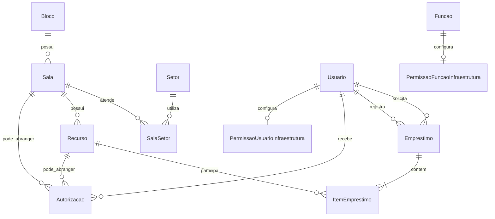

# Infraestrutura — contexto consolidado

> Documento vivo. Atualizado em 13/07/2026.

## Identidade e objetivo

- **Chameco**: sistema legado.
- **Sigec**: nome provisório usado no levantamento.
- **Infraestrutura**: nome atual do novo módulo do Cortex/MeuIF.
- Será um menu principal expansível na barra lateral, no mesmo nível de Organizacional, Pessoas Institucionais e Acadêmico.
- Controlará recursos físicos, autorizações, empréstimos e devoluções.
- **Reservas** fazem parte do domínio, mas ficam para **entrega posterior**; o foco da v1 é o operador (guarda) liberar o recurso para quem retira.

## Fontes

- [Funcionamento do Chameco legado](funcionamento-antigo-sigec.md)
- [Requisitos recebidos](Sigec%20-%20Requisitos.pdf)
- [DER recebido](Sigec.webp)
- [Plano de implementação](../planning/milestone-infraestrutura-plan.md)

## Requisitos essenciais (v1)

- Todo recurso possui código de negócio diferente da PK e cadastro individual.
- Tipos iniciais: **chave**, **mídia** e **material didático**.
- Um empréstimo pode conter vários recursos.
- Cada item pode ser devolvido separadamente; o empréstimo termina quando todos forem devolvidos.
- Deve ser possível consultar e filtrar empréstimos abertos ou concluídos por recurso, tipo, retirada, devolução, solicitante e responsável (consulta ampla só para operadores).
- A listagem padrão ordena **abertos primeiro** (por data de retirada, mais recentes primeiro) e em seguida os **fechados** (mesma ordenação por data).
- Recursos e usuários devem ser encontrados por nome/código e nome/matrícula.
- Empréstimos abertos há mais de 24 horas devem ser **sinalizados na interface** (sem e-mail ou outro canal na v1).
- A interface deve permanecer simples, concentrar operação e consulta e permitir criar empréstimos em até quatro cliques.

## Usuários e acesso

- A interface `UsuarioCortex` do DER corresponde diretamente a `Identidade.usuarios.Usuario`; não haverá espelho local de usuários ou tokens.
- Nome e foto vêm de `Usuario`; matrícula vem de `Identidade.matriculas.Matricula` (join; sem snapshot).
- Todo solicitante, inclusive colaborador externo, deverá possuir `Usuario` no Cortex.
- No empréstimo:
  - **solicitante** é quem recebe os recursos;
  - **responsável** é quem entrega o recurso na retirada (pessoa física).
- Conta **`usuario_coletivo`** (ex.: login da guarita) autentica a sessão; o responsável é escolhido no pool associado (empresas, cargos, funções, setores) via `GET emprestimos/responsaveis-elegiveis/`.
- Em conta não coletiva, o responsável é o próprio usuário autenticado.
- Conta coletiva não pode ser solicitante nem responsável de empréstimo.
- A flag `usuario_coletivo` é definida na criação/edição do usuário; o pool é mantido em endpoints separados de Identidade (`/usuarios/{pk}/coletivo/`).

### Níveis Cortex × módulo (L1 < L2 < L3)

| Nível | Papel no módulo |
|-------|-----------------|
| **L1** | Solicitante comum: vê apenas empréstimos **ativos** no próprio nome; sem histórico; não opera |
| **L2** | Operação do dia a dia (guardas, auxiliares): emprestar, devolver, trocar titular e consultar (`operar`) |
| **L3** | Autorizar/desautorizar (`autorizar`); tipicamente também cadastra estrutura e opera |

Capacidades finas vêm de duas fontes (união OR na compilação `permissoes_infraestrutura()`), separadas de L1–L3 do Cortex:

1. **Por função** — vínculo com `Organizacional.funcoes.Funcao` via `PermissaoFuncaoInfraestrutura` (**sem** campos novos em `Funcao`).
2. **Por usuário** — `PermissaoUsuarioInfraestrutura` (OneToOne com `Usuario`), para concessões pontuais (ex.: conta coletiva da guarita).

### Capacidades v1

| Capacidade | Libera |
|------------|--------|
| `operar` | Retirada, devolução, troca de titular e consulta ampla de empréstimos |
| `cadastrar` | Blocos, salas, recursos e vínculos sala–setor |
| `autorizar` | Conceder e revogar autorizações |
| `retirada_irrestrita` | Solicitar qualquer recurso (ex.: diretores / coordenadores / chefes) |

### Regras automáticas de retirada (além de autorização explícita)

- Solicitante com vínculo ativo em setor ligado à sala (`SalaSetor`) pode retirar recursos tipo **chave** dessa sala.
- Terceirizado com cargo **servente de limpeza** pode retirar **qualquer chave**.
- Demais casos (outros tipos, externos, sem vínculo): exigem `Autorizacao` explícita ou capacidade `retirada_irrestrita`.

## Autorizações

- Podem ser **temporárias** (`data_inicio` / `data_fim`) ou **permanentes** (`data_fim` nula).
- Alvo **XOR**: exatamente um de `sala` ou `recurso`.
- Autorização por sala vale para **todos** os recursos da sala, inclusive os cadastrados depois (avaliação em runtime).
- Registram beneficiário, concedente, período, revogação (`revogado_em` + `revogador`) e observação.
- Só quem tem capacidade `autorizar` concede ou revoga.
- Complementam o acesso automático por função, cargo ou vínculo setorial.

## Estrutura planejada

O domínio agregador será `Infraestrutura/`, seguindo a ADR de modularização do Cortex:

- `blocos`: `Bloco`;
- `salas`: `Sala` e `SalaSetor`;
- `recursos`: `Recurso`;
- `emprestimos`: `Emprestimo` e `ItemEmprestimo`;
- `autorizacoes`: autorizações por sala ou recurso;
- `permissoes`: capacidades de Infraestrutura por função e por usuário;
- `reservas`: **entrega futura** (bloqueios futuros; não implementar na v1).

Não será criado outro módulo chamado `Sigec`.

## Relações principais

## Decisões de modelagem

- Entidades de negócio usam `BasicModel` (datas + histórico).
- Relações históricas com usuários e recursos usam proteção contra exclusão (`PROTECT`).
- Bloco, Sala e Recurso possuem `ativo`; recursos **só desativam** (sem exclusão física de negócio).
- `Recurso.codigo` é único na instância (campus); distinto da PK.
- Tipo `chave` exige `sala`; `midia` e `material_didatico` têm `sala` opcional.
- Sem distinção principal/reserva; eventual detalhe na descrição.
- Sem campo de patrimônio/tombo separado na v1 (usar descrição se necessário).
- Estado exibido do recurso: **avaria → emprestado → reservado → disponível**. Avaria é **estado simples** na v1; “reservado” só passa a aplicar quando reservas existirem.
- Retirada e devolução são transacionais; impede dois empréstimos abertos para o mesmo recurso.
- Empréstimo: observação/descrição opcional no cabeçalho; encerrado = derivado (todos os `ItemEmprestimo.devolvido_em` preenchidos); sem `status` explícito.
- Troca de titular: uma ação que, por baixo, devolve e abre novo empréstimo com as **mesmas regras**; sem vínculo entre o registro antigo e o novo.
- `SalaSetor`: `sala` + `setor` com unicidade conjunta.
- Autorização permanente: `data_fim` nula.
- Implantação prevista **por campus** (instância dedicada); sem FK de campus no módulo.
- Permissões do módulo via `permissoes_infraestrutura()`, fora dos níveis gerais L1–L3 do Cortex (que condicionam o público: L1 lê ativos próprios; L2 opera; L3 autoriza).

## Entrega futura (fora da v1)

- App e regras de **reservas** (bloqueio futuro; conflitos com empréstimo/avaria).
- Fluxo rico de manutenção de avaria (além do estado simples).
- Multi-campi na mesma instância.
- Canal de notificação do alerta >24h além da UI.
