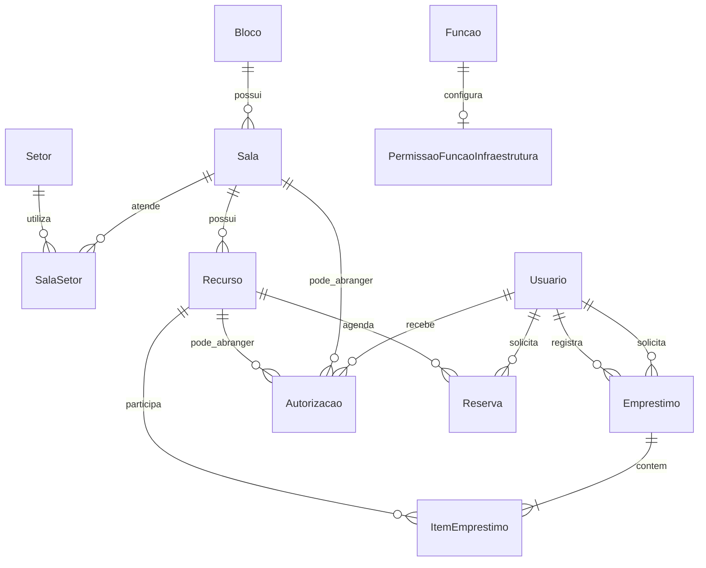

# Infraestrutura — contexto consolidado

> Documento vivo. Atualizado em 13/07/2026.

## Identidade e objetivo

- **Chameco**: sistema legado.
- **Sigec**: nome provisório usado no levantamento.
- **Infraestrutura**: nome atual do novo módulo do Cortex/MeuIF.
- Será um menu principal expansível na barra lateral, no mesmo nível de Organizacional, Pessoas Institucionais e Acadêmico.
- Controlará recursos físicos, reservas, autorizações, empréstimos e devoluções.

## Fontes

- [Funcionamento do Chameco legado](funcionamento-antigo-sigec.md)
- [Requisitos recebidos](Sigec%20-%20Requisitos.pdf)
- [DER recebido](Sigec.webp)

## Requisitos essenciais

- Todo recurso possui código de negócio diferente da PK e cadastro individual.
- Tipos iniciais: **chave**, **mídia** e **material didático**.
- Um empréstimo pode conter vários recursos.
- Cada item pode ser devolvido separadamente; o empréstimo termina quando todos forem devolvidos.
- Deve ser possível consultar e filtrar empréstimos abertos ou concluídos por recurso, tipo, retirada, devolução, solicitante e responsável.
- Recursos e usuários devem ser encontrados por nome/código e nome/matrícula.
- Empréstimos abertos há mais de 24 horas devem ser sinalizados ao responsável.
- A interface deve permanecer simples, concentrar operação e consulta em uma tela e permitir criar empréstimos em até quatro cliques.

## Usuários e acesso

- A interface `UsuarioCortex` do DER corresponde diretamente a `Identidade.usuarios.Usuario`; não haverá espelho local de usuários ou tokens.
- Nome e foto vêm de `Usuario`; matrícula vem de `Identidade.matriculas.Matricula`.
- Todo solicitante, inclusive colaborador externo, deverá possuir `Usuario` no Cortex.
- No empréstimo:
  - **solicitante** é quem recebe os recursos;
  - **responsável** é o operador que registra a retirada ou devolução.
- Vigilantes e técnicos administrativos autorizados operam empréstimos, devoluções e consultas.
- Diretores, coordenadores e chefes de departamento podem retirar qualquer recurso e conceder ou revogar autorizações.
- Essas capacidades serão configuradas no módulo por vínculo com `Organizacional.funcoes.Funcao`, sem adicionar campos específicos à própria `Funcao`.
- Uma sala pode estar vinculada a vários setores. Servidores e monitores vinculados a esses setores podem retirar suas chaves.
- Terceirizados com cargo de servente de limpeza podem retirar qualquer chave do campus.

## Autorizações

- Podem ser **temporárias** ou **permanentes**.
- Podem abranger:
  - um recurso específico; ou
  - todos os recursos de uma sala, incluindo qualquer chave cadastrada nela.
- Devem registrar beneficiário, concedente, período, revogação, revogador e observação.
- Autorizações complementam o acesso automático por função, cargo ou vínculo setorial.

## Estrutura planejada

O domínio agregador será `Infraestrutura/`, seguindo a ADR de modularização do Cortex:

- `blocos`: `Bloco`;
- `salas`: `Sala` e `SalaSetor`;
- `recursos`: `Recurso`;
- `reservas`: reservas futuras;
- `emprestimos`: `Emprestimo` e `ItemEmprestimo`;
- `autorizacoes`: autorizações por sala ou recurso;
- `permissoes`: capacidades de Infraestrutura associadas às funções.

Não será criado outro módulo chamado `Sigec`.

## Relações principais

## Decisões de modelagem

- Relações históricas com usuários e recursos usarão proteção contra exclusão.
- Reservas representam bloqueios futuros; não significam empréstimo aberto.
- O estado exibido do recurso será derivado com prioridade: **avaria → emprestado → reservado → disponível**, evitando duplicidade de estado.
- Retirada e devolução serão transacionais, impedindo dois empréstimos abertos para o mesmo recurso.
- Entidades de negócio usarão `BasicModel` para datas e histórico.
- Permissões específicas serão compiladas por `permissoes_infraestrutura()`, separadas dos níveis gerais L1–L3 do Cortex.

## Ainda pendente

- Canal do alerta de 24 horas: apenas interface, e-mail ou outra notificação.
- Manutenção da troca de titular existente no Chameco legado.
- Necessidade de distinguir chave principal e reserva.
- Política de exclusão ou apenas desativação de recursos.
- Possível suporte futuro a múltiplos campi.
